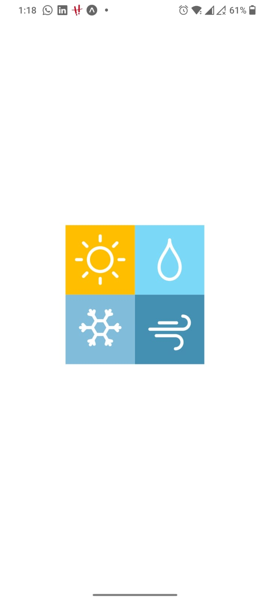
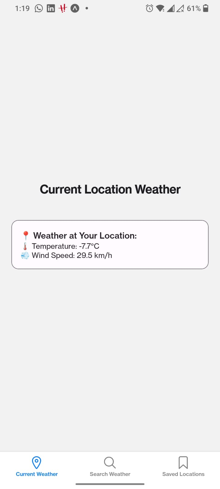
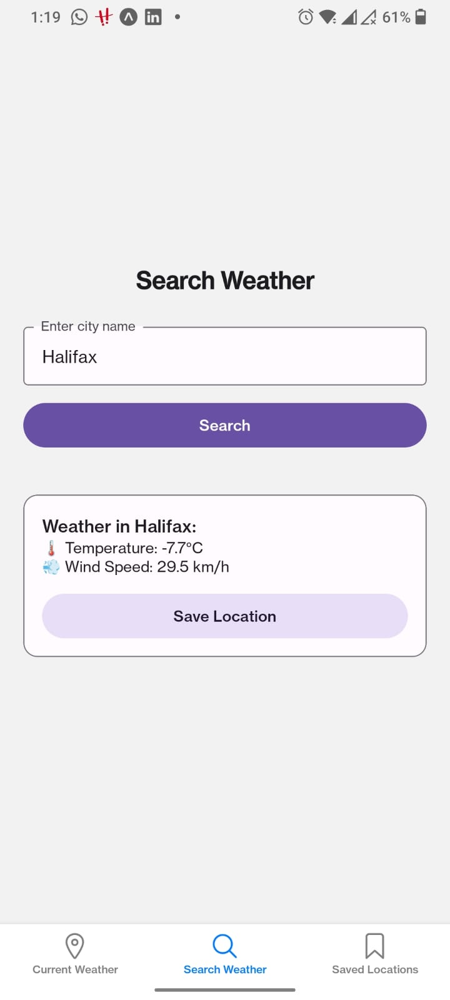
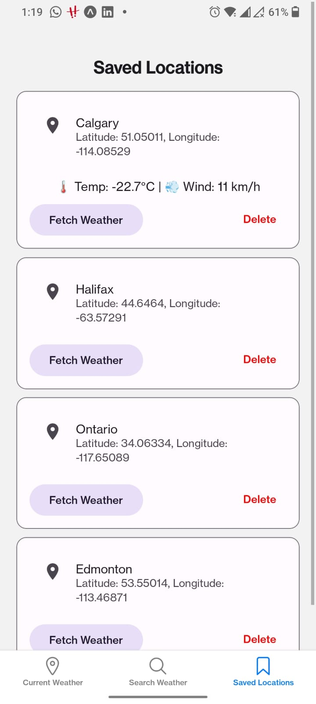

# 📌 React Native Weather App  

A simple weather app built with **React Native (Expo)** that allows users to:  
✔ **View weather** at their **current location** 🌍  
✔ **Search for a city** and see its weather 🌤  
✔ **Save up to 4 favorite cities** for quick access 📍  
✔ **Delete saved cities** when needed ❌  

---

## 📸 Screenshots  
| Splash Screen | Current Location Weather | Search & Save | Saved Locations |
|-----------------|-----------------|-----------------|-----------------|
 |  |  |  |

---

## 🛠️ Technologies Used  
- **React Native** (Expo) ⚛️  
- **TypeScript** 🔹  
- **SQLite** (expo-sqlite) for local storage 🗄️  
- **React Navigation** for tab-based navigation 🔄  
- **Open-Meteo API** for weather data ☁️  
- **React Native Paper** for UI components 🎨  

---

## 📂 Project Structure  
```bash
/weather-app
├── /src
│   ├── /screens
│   │   ├── CurrentLocationWeather.tsx
│   │   ├── SearchWeather.tsx
│   │   ├── SavedLocations.tsx
│   ├── /database
│   │   ├── database.ts
│   ├── /components
│   │   ├── WeatherCard.tsx
│   ├── App.tsx
│   ├── README.md
│   ├── package.json
│   ├── app.json
```

## 📥 Installation & Setup

1️⃣ Clone the repository:  
```sh
git clone https://github.com/A00483108/weatherRnApp.git
cd weatherRnApp
```
2️⃣ Install dependencies:
```sh
npm install
```
3️⃣ Start the development server:
```sh
npx expo start
```


## 🚀 Features
Current Location Weather: Get real-time weather updates for your GPS location.
Search for a City: Look up weather for any city worldwide.
Save Locations: Store up to 4 favorite cities for quick access.
Remove Locations: Easily delete saved locations.
Offline Storage: Uses SQLite to store saved cities locally.


## 📌 API Used
This app uses the Open-Meteo API for weather and geolocation data.
🔗 [Open-Meteo API Documentation](https://open-meteo.com/en/docs)


## 🏗️ How It Works
1️⃣ Current Location Weather Screen
Uses expo-location to get the user's coordinates.
Fetches real-time weather from Open-Meteo API.
2️⃣ Search & Save Weather Screen
Users can search for a city's weather.
The Save Location button allows storing the city (up to 4).
3️⃣ Saved Locations Screen
Displays saved cities with their weather.
Allows deleting locations from the list.
Reloads automatically when navigated to.


## 🔧 Dependencies
``` json
"dependencies": {
  "expo": "~49.0.0",
  "react": "18.2.0",
  "react-native": "0.72.0",
  "expo-location": "~15.0.1",
  "expo-sqlite": "~11.0.0",
  "axios": "^1.5.0",
  "react-native-paper": "^5.11.2",
  "react-navigation": "^6.1.0",
  "react-navigation-tabs": "^6.5.2"
}
```

## 👨‍💻 Developed By
💡 Sukanta Dey Amit